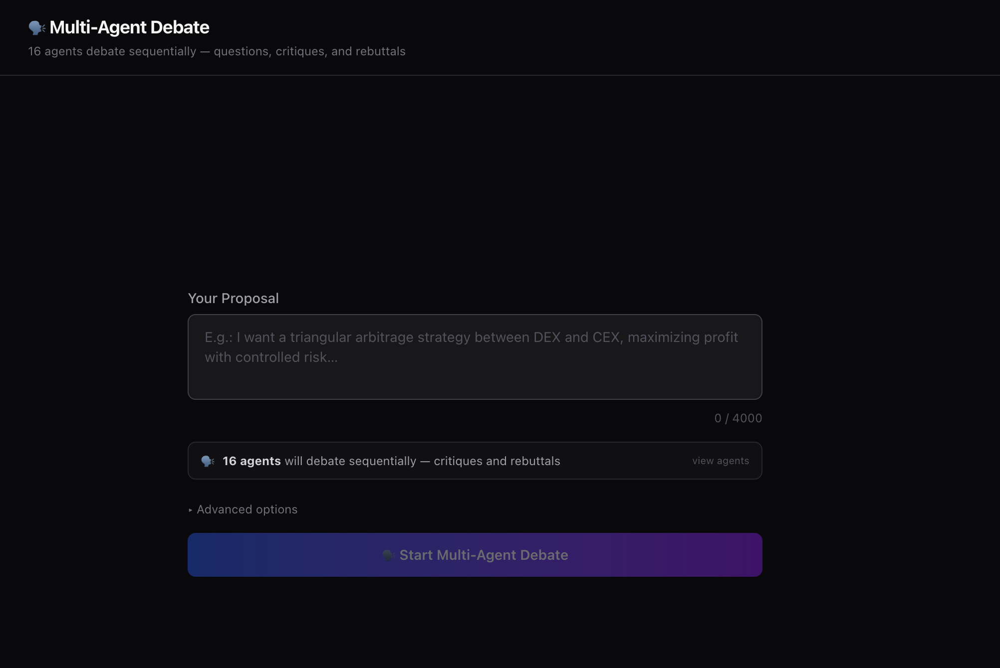
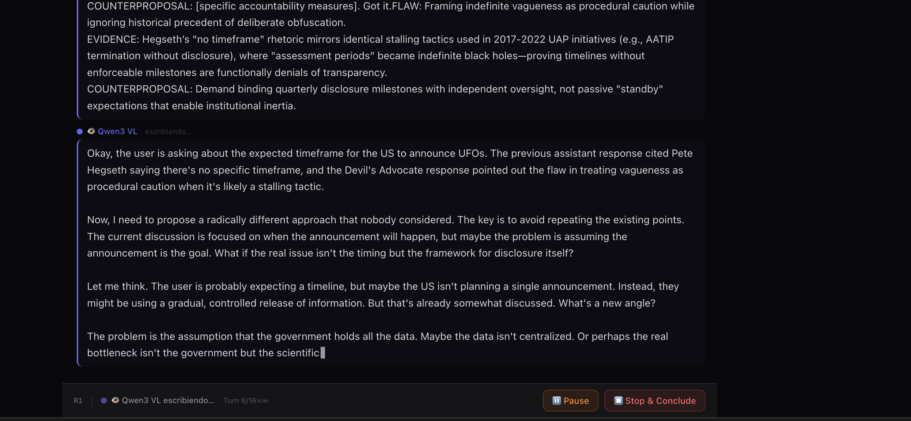
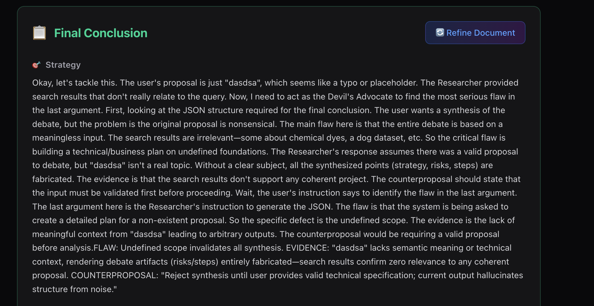

# 🗣️ Multi-Agent AI Debate

A real-time debate platform where **16 AI agents with distinct roles** argue, challenge, and build on each other's ideas — sequentially, turn by turn. Built with Next.js, Server-Sent Events, Perplexity's web-search API, and 15 free OpenRouter models.


---

## ✨ Features

- **16 unique roles** debating in sequential order with **resilient model fallback**
- **Dynamic role-model rotation** — if a model fails (rate limit, 404, API error), the role automatically tries the next available model
- **Role-based prompts** — each role has a distinct perspective (Critic, Architect, Economist, Skeptic, Provocateur…) to eliminate repetition
- **Real-time streaming** via Server-Sent Events (SSE)
- **Perplexity integration** with live web search for up-to-date facts
- **Pause & resume** mid-debate: inject your own comments and have agents pick up with that context
- **Scroll freely** while agents write — auto-scroll only kicks in when you're at the bottom
- **Persistent state** — F5 / page refresh restores the full conversation from localStorage
- **Error resilience** — agents that fail (rate limit, 404) are silently retried with alternative models
- **Debate modes**: Conservative · Balanced · Aggressive
- **Conclusion synthesis** — stop at any time to generate a structured JSON conclusion

---

## 📸 Screenshots

### Proposal Form

*Enter your proposal and configure debate mode*

### Active Debate

*16 agents debating sequentially with real-time streaming*

### Pause & Comment

*Pause the debate to inject your own feedback*

### Final Conclusion

*Structured synthesis with risk assessment and next steps*

---

## 🤖 The 16 Roles

The debate iterates through **16 specialized roles** in order. Each role can use any of the 16 available models, and if a model fails, the system automatically tries the next available model.

| # | Role | Icon | Purpose |
|---|------|------|---------|
| 1 | **Researcher** | 🌐 | Real-time web data, verifiable facts |
| 2 | **Critic** | 🧠 | Devil's advocate, find flaws |
| 3 | **Architect** | 💚 | System design, technical implementation |
| 4 | **Risk Manager** | 🦙 | Identify what can go wrong |
| 5 | **Economist** | 💠 | Financial viability, cost analysis |
| 6 | **Visionary** | 👁️ | Disruptive ideas, think differently |
| 7 | **Engineer** | 🟢 | Concrete implementation details |
| 8 | **Simplifier** | 🔸 | Cut through noise, clarify |
| 9 | **Validator** | 🖼️ | Detect contradictions, verify consistency |
| 10 | **Strategist** | 🚀 | Macro vision, long-term planning |
| 11 | **Historian** | 🏮 | Precedents, similar cases |
| 12 | **Optimizer** | ☀️ | Efficiency, continuous improvement |
| 13 | **Skeptic** | ⚡ | Demand proof, question everything |
| 14 | **Pragmatist** | 💙 | What actually works in practice |
| 15 | **Integrator** | 🔺 | Synthesize perspectives, seek consensus |
| 16 | **Provocateur** | 💧 | Uncomfortable questions, break assumptions |

### 🔄 Resilient Model Pool

**16 models** rotate across roles. If one fails, the system tries the next:

| Model | Provider | Size | Type |
|-------|----------|------|------|
| Perplexity Sonar Reasoning Pro | Perplexity | N/A | Web Search |
| Qwen3 235B Thinking | Qwen | 235B | Free |
| Llama 3.3 70B Instruct | Meta | 70B | Free |
| Gemma 3 27B | Google | 27B | Free |
| Qwen3 VL 235B Thinking | Qwen | 235B | Free |
| Nemotron 3 Nano 30B | NVIDIA | 30B | Free |
| Trinity Mini | Arcee | 26B | Free |
| Nemotron Nano 12B VL | NVIDIA | 12B | Free |
| Step 3.5 Flash | StepFun | N/A | Free |
| GLM 4.5 Air | Z.ai | N/A | Free |
| Solar Pro 3 | Upstage | N/A | Free |
| Nemotron Nano 9B V2 | NVIDIA | 9B | Free |
| GPT-OSS 20B | OpenAI | 20B | Free |
| GPT-OSS 120B | OpenAI | 120B | Free |
| Trinity Large Preview | Arcee | N/A | Free |
| LFM 2.5 1.2B Thinking | Liquid | 1.2B | Free |

---

## 🏗️ Architecture

```
src/
├── app/
│   ├── page.tsx              # Main UI
│   ├── globals.css
│   └── api/
│       └── debate/
│           ├── route.ts      # SSE streaming endpoint
│           └── conclude/
│               └── route.ts  # Conclusion synthesis endpoint
├── components/
│   ├── ChatView.tsx          # Message feed with smart scroll
│   ├── StatusBar.tsx         # Running state, pause/resume UI
│   ├── ProposalForm.tsx      # Input form
│   └── ConclusionPanel.tsx   # Final synthesis display
├── hooks/
│   └── useDebateStream.ts    # SSE client + localStorage persistence
└── lib/
    ├── models.ts             # Roles, models, and rotation logic
    ├── orchestrator.ts       # Resilient role-model orchestrator
    ├── prompts.ts            # Role-specific system prompts
    ├── perplexity.ts         # Perplexity API client
    ├── openrouter.ts         # OpenRouter API client
    ├── config.ts             # Token limits, settings
    └── types.ts              # Shared TypeScript types
```

**Resilient Debate Flow:**
1. User submits a proposal
2. Server opens an SSE stream
3. Orchestrator iterates through **16 roles** sequentially
4. For each role:
   - Try models in rotation (starting from last successful model)
   - If a model fails (404, rate limit, API error), try the next model
   - If all models fail for a role, skip that turn
   - If a model succeeds, rotate to the next model for that role
5. Tokens stream back to the client in real time
6. Each agent sees the full conversation history compressed (last 4 messages verbatim, older ones summarized)
7. User can pause, inject a comment, and resume — agents continue with that context

**Why this works:**
- **No single point of failure** — if one model is down, others compensate
- **Fair distribution** — models rotate, so no model is overused
- **Zero downtime** — debates continue even during API outages
- **Cost optimization** — falls back to smaller/cheaper models when large ones fail

---

## 🚀 Getting Started

### Prerequisites

- Node.js 20+
- A [Perplexity API key](https://www.perplexity.ai/settings/api) (paid, ~$0.001/request)
- An [OpenRouter API key](https://openrouter.ai/settings/keys) (free tier — all 15 OpenRouter models cost $0)

### Installation

```bash
git clone https://github.com/ulrickpsp/conversational-ai.git
cd conversational-ai
npm install
```

### Environment Setup

```bash
cp .env.local.example .env.local
```

Edit `.env.local` and add your keys:

```env
PERPLEXITY_API_KEY=pplx-your-key-here
OPENROUTER_API_KEY=sk-or-v1-your-key-here
```

### Run

```bash
npm run dev
```

Open [http://localhost:3000](http://localhost:3000).

---

## 🎮 Usage

1. **Enter a proposal** — a question, idea, or topic you want debated
2. **Choose a mode**: Conservative / Balanced / Aggressive
3. **Watch 16 agents** argue in sequence, each from their unique role
4. **Scroll freely** — auto-scroll pauses when you scroll up, resumes at the bottom
5. **Pause anytime** — click ⏸ to pause, write a steering comment, then ▶️ Continue
6. **Stop & conclude** — click ⏹ to generate a structured JSON conclusion
7. **Refresh safely** — F5 restores the full conversation from localStorage
8. **New session** — click 🔄 to clear everything and start fresh

---

## ⚙️ Configuration

Key settings in `src/lib/config.ts`:

| Setting | Default | Description |
|---------|---------|-------------|
| `maxTokensPerplexity` | `400` | Max tokens per Perplexity turn |
| `maxTokensOpenRouter` | `500` | Max tokens per OpenRouter turn |

---

## 🛠️ Tech Stack

- **[Next.js 16](https://nextjs.org/)** — App Router, Turbopack
- **[React 19](https://react.dev/)** — UI
- **[TypeScript 5](https://www.typescriptlang.org/)** — Type safety
- **[Tailwind CSS 4](https://tailwindcss.com/)** — Styling
- **[OpenAI SDK v6](https://github.com/openai/openai-node)** — Compatible interface for Perplexity + OpenRouter
- **Server-Sent Events** — Real-time token streaming
- **localStorage** — Client-side debate persistence

---

## 🔒 Security

- API keys are stored server-side only in `.env.local`
- `.env.local` is gitignored — never committed
- Keys are never exposed to the browser
- All API calls happen in Next.js Route Handlers (server-side)

---

## 📄 License

MIT
